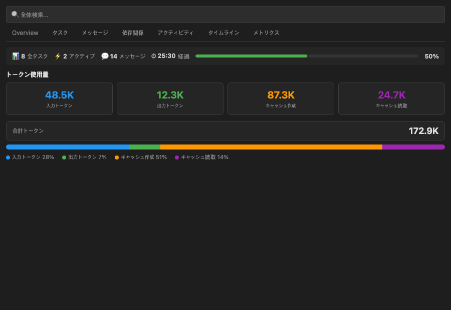
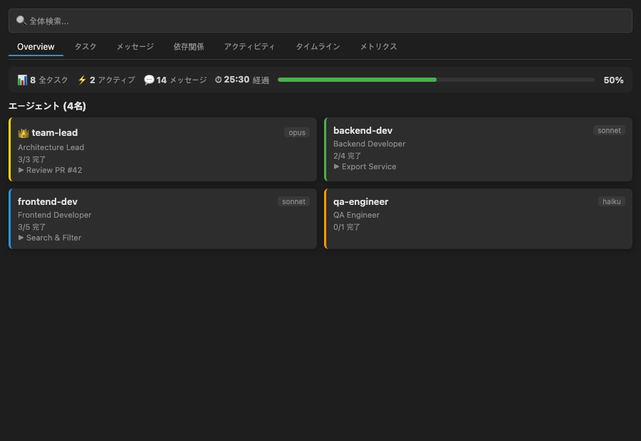
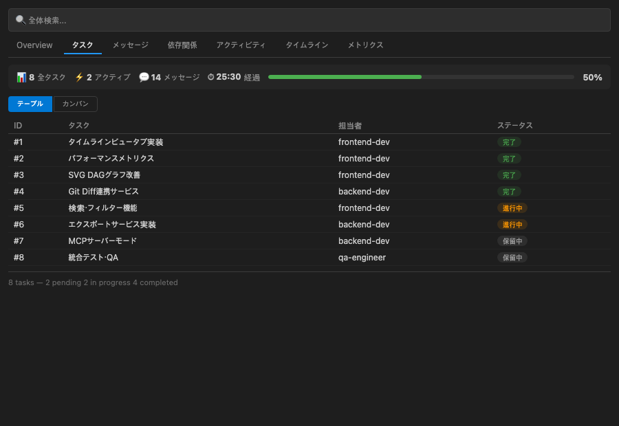
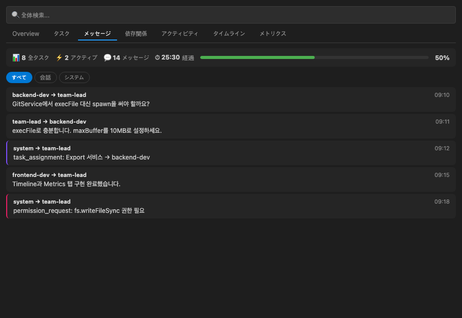
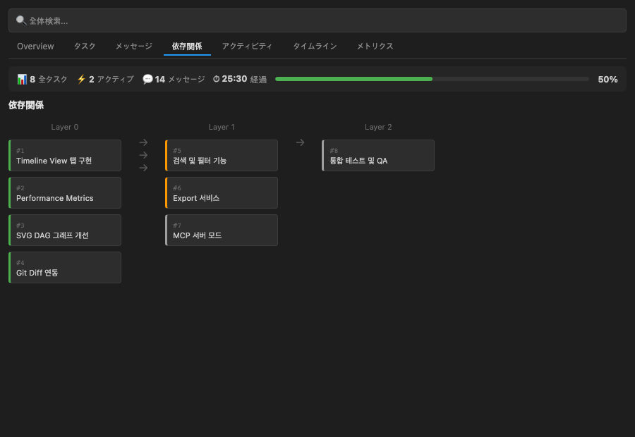
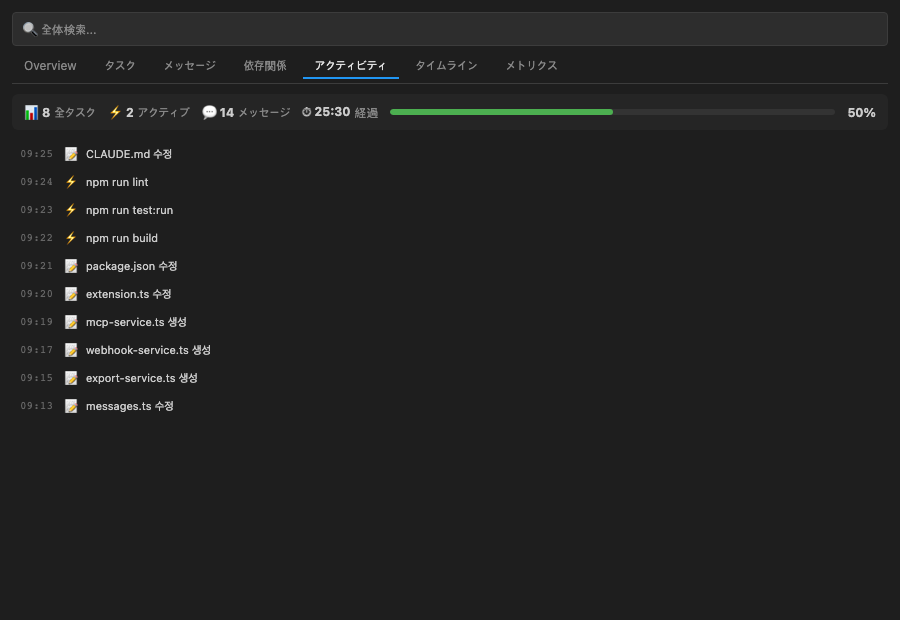
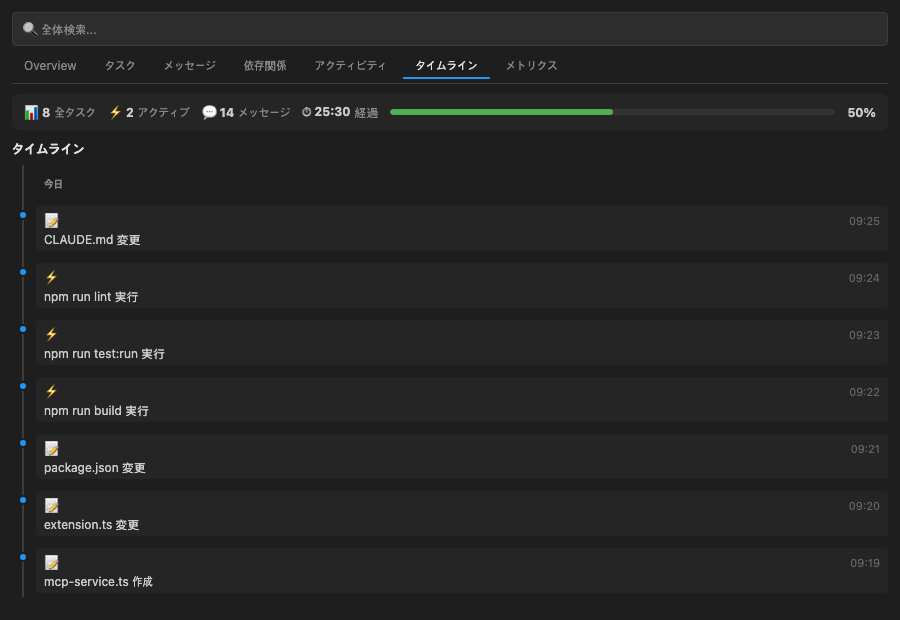
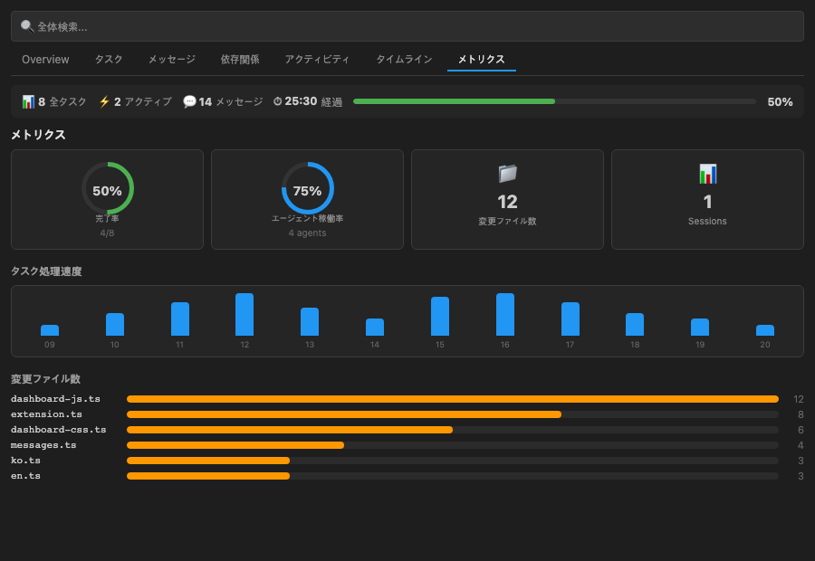

<p align="center">
  
</p>

<h1 align="center">Claude Flow Monitor</h1>

<p align="center">
  Claude Code のワークフローとエージェントチームをリアルタイムで可視化する VS Code 拡張機能
</p>

<p align="center">
  <a href="https://marketplace.visualstudio.com/items?itemName=koh-dev.claude-flow-monitor">
    
  </a>
  <a href="https://marketplace.visualstudio.com/items?itemName=koh-dev.claude-flow-monitor">
    
  </a>
  
  
</p>

<p align="center">
  🌐 <a href="README.ko.md">한국어</a> | <a href="README.md">English</a> | 日本語 | <a href="README.zh.md">中文</a>
</p>

---

## 主な機能

### 7タブ統合ダッシュボード

`Cmd+Shift+P` → **Claude Flow Monitor: Open Dashboard** でフルスクリーンのダッシュボードを開きます。

| タブ | 説明 |
|------|------|
| **Overview** | チームの稼働状況、エージェント一覧、進捗サマリー |
| **Tasks** | テーブル表示 / カンバンボード切替（Pending / In Progress / Completed） |
| **Messages** | エージェント間メッセージのスレッドビュー、All/Conversation/System フィルター |
| **Deps** | タスク間の blockedBy/blocks 関係を SVG DAG グラフで可視化 |
| **Activity** | ファイル変更・コマンド実行・タスク更新のリアルタイムフィード（最大200件） |
| **Timeline** | 時系列イベントビュー（日付グループ付き） |
| **Metrics** | ドーナツチャート・速度グラフ・ファイルヒートマップによるパフォーマンス分析 |

### サイドバー & ミニダッシュボード

- Activity Bar にアイコンが追加されます（サイドバーアイコン）
- **チームツリービュー** — チーム → エージェント → タスクの階層構造
- **ステータスバー** — チーム名と完了率をクイック表示。クリックでミニダッシュボードを表示

### 検索 / フィルター

- 全タブ共通のグローバル検索バー
- `Ctrl+F` キーボードショートカット対応
- タブごとの絞り込みフィルター

### AI ファイルバッジ

- AI が変更したファイルにエクスプローラーで **`AI`** バッジを表示（`FileDecorationProvider`）
- Git の `Co-Authored-By` コミットを解析して AI 貢献度を追跡

### Git 連携

- `Co-Authored-By: Claude` コミットを自動識別
- AI 貢献ファイル一覧をダッシュボードに表示

### エクスポート

| 形式 | コマンド |
|------|---------|
| CSV | `Claude Flow Monitor: Export as CSV` |
| Markdown レポート | `Claude Flow Monitor: Generate Report` |

### MCP サーバー連携

- `.mcp.json` を解析して接続中 MCP サーバー一覧を表示
- HTTP JSON API モード（`/api/teams`、`/api/activities`、`/api/metrics`）

### Webhook 通知

- タスク完了・エージェント参加/離脱イベントを **Slack / Discord** に通知
- `ccFlowMonitor.webhookUrl` に URL を設定するだけで有効化

### トークン使用量モニタリング
- セッション JSONL から**入力/出力/キャッシュトークン**をリアルタイム集計
- Metrics タブに 4 色トークンカード + 合計バー + 比率セグメントバー表示
- 入力(青)、出力(緑)、キャッシュ作成(橙)、キャッシュ読取(紫)で色分け
- プロジェクト履歴保存 (`cfm-stats.json`) — 再起動後も累計統計を維持



### スクリーンショット & 機能紹介

#### Overview — エージェント状況を一目で確認

- チーム内の全**エージェントをカード形式**で表示（名前、モデル、役割）
- 各エージェントの**現在のタスク**と**進捗率**をリアルタイム表示
- 上部Stats Barでタスク総数、アクティブ、メッセージ、経過時間を確認
- リーダーエージェントは👑アイコンで区別

#### Tasks — タスク管理（テーブル/カンバン）

- **テーブルビュー**: ID、タスク名、担当者、ステータスをソート可能なテーブルで表示
- **カンバンビュー**: Pending → In Progress → Completed の3列ボード
- ブロッカー関係を表示（`blocked by: #5, #6`）
- **検索バー**でタスク名、担当者、IDをフィルタリング

#### Messages — エージェント間コミュニケーション

- エージェント間の**リアルタイムメッセージストリーム**を表示
- **フィルター**: すべて / 会話 / システムメッセージ
- システムメッセージは紫色、権限リクエストはピンク色の左ボーダーで区別
- メッセージ本文を最大500文字までプレビュー

#### Dependencies — SVG依存関係グラフ

- タスク間の依存関係を**DAG（有向非巡回グラフ）**で可視化
- **ベジェ曲線**と矢印でブロッキング関係を表示
- レイヤー別グルーピング（Layer 0 → Layer 1 → Layer 2）
- ノードはステータスごとに色分け（完了=緑、進行中=オレンジ、保留=灰色）

#### Activity Feed — リアルタイムアクティビティフィード

- ファイル編集(📝)、コマンド実行(⚡)、タスク変更(✅)、メッセージ(💬)の統合フィード
- 最大200件のアクティビティを時系列で表示
- 検索バーでアクティビティ内容をフィルタリング可能
- タイムスタンプはHH:MM:SS形式

#### Timeline — 時系列イベントタイムライン

- すべてのイベントを**縦型タイムライン**で可視化
- **日付別グルーピング**（今日 / 以前）
- イベントタイプごとの色付きドット（ファイル=青、タスク=緑、エラー=赤）
- 詳細情報（ファイルパス、コマンドなど）を展開表示

#### Metrics — パフォーマンスダッシュボード

- **ドーナツチャート**: タスク完了率とエージェント稼働率を視覚的に表示
- **速度チャート**: 時間帯別アクティビティ数をバーチャートで表示（直近12時間）
- **ファイルヒートマップ**: 最も編集されたファイルTop 10を水平バーチャートで表示
- セッション数、メッセージ数、経過時間のサマリーカード

---

## インストール

### VS Code Marketplace（推奨）

```
ext install koh-dev.claude-flow-monitor
```

または VS Code の拡張機能パネルで **"Claude Flow Monitor"** を検索してください。

### .vsix ファイルによる手動インストール

```bash
git clone https://github.com/koh0001/claude-flow-monitor.git
cd claude-flow-monitor
npm install
npm run build
npm run package
# 生成された .vsix ファイルを VS Code にインストール
# VS Code: Extensions パネル → 「...」メニュー → 「VSIX からインストール」
```

### 動作要件

- VS Code 1.90.0 以上
- Node.js 20.0.0 以上（開発時のみ）
- Claude Code Agent Teams が有効化されていること（チームデータが必要）

---

## クイックスタート

1. VS Code を開き、Activity Bar の **Claude Flow Monitor アイコン**をクリックします
2. サイドバーのツリービューでチームを確認します
3. `Cmd+Shift+P` を押して **"Claude Flow Monitor: Open Dashboard"** を実行します
4. タブを切り替えて Overview / Tasks / Messages / Deps / Activity / Timeline / Metrics を確認します

---

## 設定

VS Code の設定（`settings.json`）で以下の項目を変更できます。

| 設定キー | デフォルト値 | 説明 |
|---------|------------|------|
| `ccFlowMonitor.language` | `auto` | 表示言語（`auto` / `ko` / `en` / `ja` / `zh`） |
| `ccFlowMonitor.notifications` | `true` | リアルタイム通知の有効/無効 |
| `ccFlowMonitor.claudeDir` | `""` | `~/.claude` ディレクトリのパスを上書き |
| `ccFlowMonitor.webhookUrl` | `""` | Slack / Discord の Webhook URL |
| `ccFlowMonitor.mcpServerPort` | `0` | MCP サーバーポート（`0` でランダム割当） |
| `ccFlowMonitor.timeFormat` | `HH:MM:SS` | 時刻表示形式（`HH:MM:SS` / `HH:MM` / `MM:SS`） |

### 設定例（settings.json）

```json
{
  "ccFlowMonitor.language": "ja",
  "ccFlowMonitor.notifications": true,
  "ccFlowMonitor.claudeDir": "/custom/path/.claude",
  "ccFlowMonitor.webhookUrl": "https://hooks.slack.com/services/xxx/yyy/zzz",
  "ccFlowMonitor.mcpServerPort": 3456,
  "ccFlowMonitor.timeFormat": "HH:MM"
}
```

### 環境変数

| 変数 | 説明 |
|------|------|
| `CC_TEAM_VIEWER_CLAUDE_DIR` | `~/.claude` ディレクトリパスの上書き（core パッケージレベル） |

---

## アーキテクチャ

```
src/
├── extension.ts                   # エントリーポイント（activate / deactivate）
├── services/
│   ├── watcher-service.ts         # core TeamWatcher ラッパー
│   ├── i18n-service.ts            # 拡張 i18n 管理
│   ├── workspace-matcher.ts       # ワークスペース ↔ プロジェクトハッシュ照合
│   ├── session-parser.ts          # セッション JSONL パーサー
│   ├── git-service.ts             # Git Co-Authored-By コミット解析
│   ├── export-service.ts          # CSV / Markdown エクスポート
│   ├── webhook-service.ts         # Slack / Discord Webhook 送信
│   └── mcp-service.ts             # MCP サーバー連携 & API
├── providers/
│   ├── dashboard-provider.ts      # WebView パネル（メッセージキュー）
│   ├── tree-provider.ts           # サイドバーツリービュー
│   ├── activity-feed-provider.ts  # Activity Feed 集計（最大200件）
│   └── file-decoration-provider.ts # AI 変更ファイルバッジ
├── types/
│   └── messages.ts                # Extension ↔ WebView メッセージ型定義
├── views/
│   ├── dashboard-html.ts          # HTML テンプレート（nonce CSP）
│   ├── dashboard-css.ts           # CSS（テーマ対応 + Stitch ベース）
│   └── dashboard-js.ts            # クライアント JS（状態管理・DOM 操作）
├── i18n/
│   ├── locales/                   # ko / en / ja / zh 翻訳ファイル
│   ├── types.ts                   # ExtendedTranslationMap
│   └── index.ts                   # i18n ファクトリ
└── utils/
    ├── escape-html.ts             # XSS 防止ユーティリティ
    └── theme-detector.ts          # テーマモード検出
```

### データフロー

```
ファイル変更 → core TeamWatcher → WatcherService → DashboardProvider → WebView
ワークスペース → WorkspaceMatcher (SHA-256) → SessionParser → ActivityFeedProvider → WebView
Git リポジトリ → GitService (Co-Authored-By) → FileDecorationProvider → エクスプローラーバッジ
通知 → WatcherService → WebhookService → Slack / Discord
エクスポート → ExportService → CSV ファイル / Markdown エディタータブ
MCP → McpService → HTTP JSON API (localhost)
```

---

## 対応言語

| 言語コード | 言語 |
|-----------|------|
| `ko` | 한국어（Korean） |
| `en` | English |
| `ja` | 日本語 |
| `zh` | 中文（Chinese） |

`ccFlowMonitor.language` を `auto` に設定すると、VS Code の表示言語に自動追従します。

---

## 開発

```bash
# 依存パッケージのインストール
npm install

# プロダクションビルド（tsup）
npm run build

# ウォッチモード（ファイル変更を自動ビルド）
npm run dev

# テスト実行（vitest）
npm test

# テスト 1 回実行（CI 用）
npm run test:run

# ESLint チェック
npm run lint

# .vsix パッケージ生成
npm run package
```

### VS Code での拡張機能デバッグ

1. リポジトリをクローンして `npm install` を実行します
2. VS Code でフォルダを開きます
3. `F5` キーを押すと **Extension Development Host** が起動します
4. 新しいウィンドウで拡張機能をテストできます

---

## コントリビュート

バグ報告・機能要望・プルリクエストを歓迎します。詳細は [CONTRIBUTING.md](CONTRIBUTING.md) をご覧ください。

1. このリポジトリをフォークします
2. フィーチャーブランチを作成します（`git checkout -b feature/amazing-feature`）
3. 変更をコミットします（`git commit -m 'feat: add amazing feature'`）
4. ブランチにプッシュします（`git push origin feature/amazing-feature`）
5. プルリクエストを作成します

---

## ライセンス

[MIT](LICENSE) © 옥현 (koh-dev)
