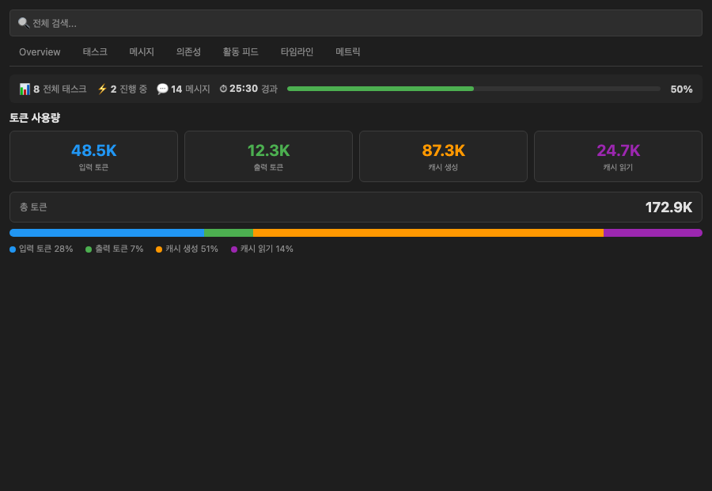
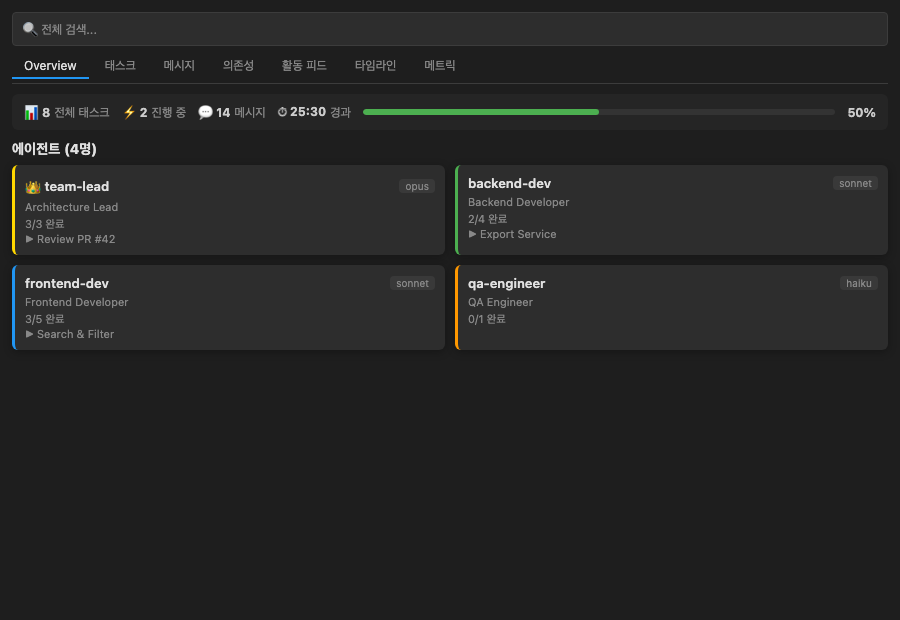
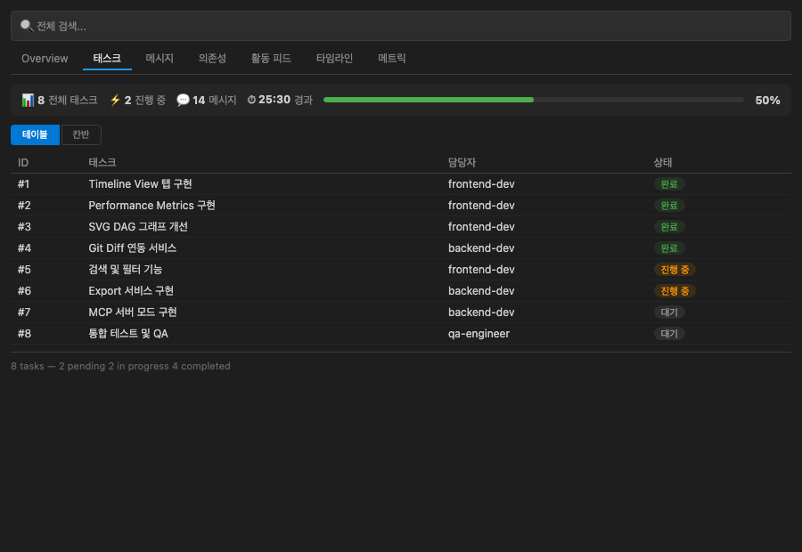
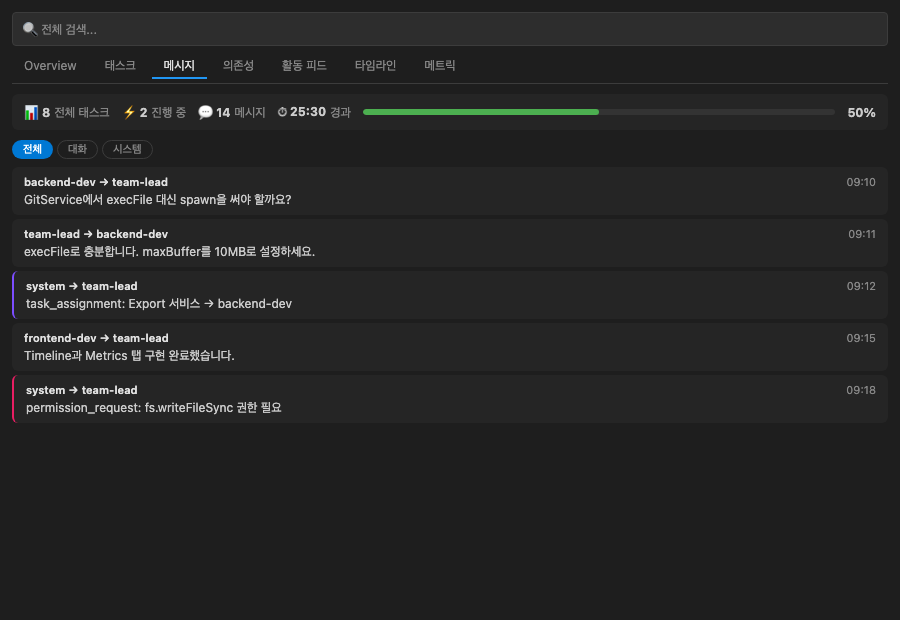
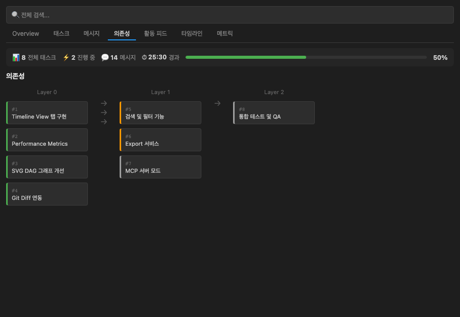
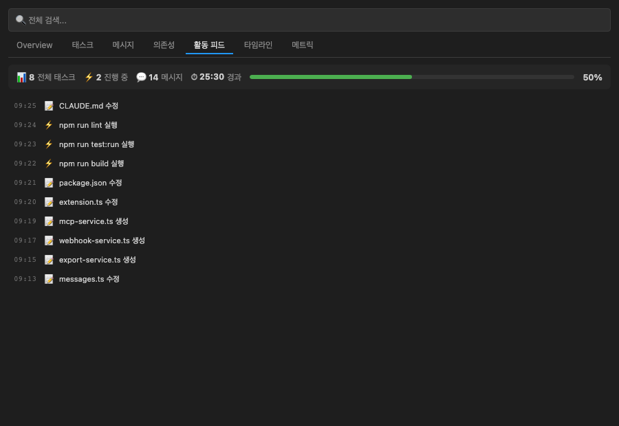
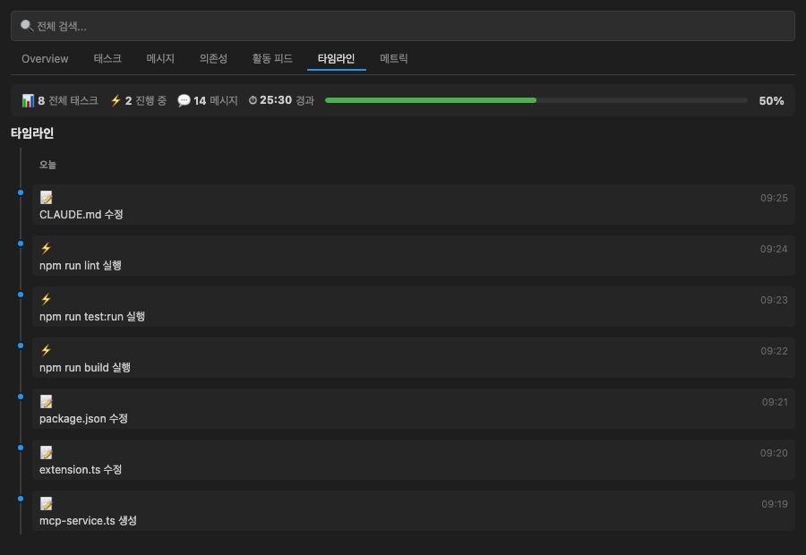
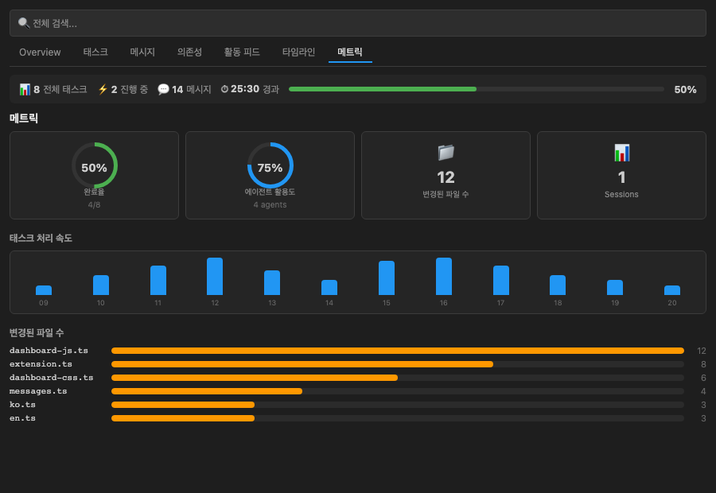

<div align="center">
  

  # Claude Flow Monitor

  **Claude Code 워크플로우와 Agent Teams를 실시간으로 시각화하는 VS Code 확장프로그램**

  [](https://marketplace.visualstudio.com/items?itemName=koh-dev.claude-flow-monitor)
  [](https://code.visualstudio.com/)
  [](LICENSE)
  [](https://www.typescriptlang.org/)

  🌐 **한국어** | [English](README.md) | [日本語](README.ja.md) | [中文](README.zh.md)
</div>

---

## 개요

Claude Flow Monitor는 `~/.claude/` 디렉토리를 실시간으로 감시하여 **현재 열린 VS Code 프로젝트의 Claude Code 활동**(세션, 파일 편집, 태스크, 에이전트)을 통합 대시보드로 시각화합니다.

기존 [cc-team-viewer](https://github.com/koh0001/cc-team-viewer)의 Agent Teams 모니터링을 계승하면서, 현재 워크스페이스 컨텍스트에 포커스한 독립 확장프로그램입니다.

---

## 주요 기능

### 7탭 통합 대시보드

| 탭 | 설명 |
|----|------|
| **Overview** | 팀 상태 요약, 에이전트 목록, 완료율 게이지 |
| **Tasks** | 태스크 목록 (Table/Kanban 토글), blocker 표시 |
| **Messages** | 에이전트 간 메시지 스레딩, All/Conversation/System 필터 |
| **Deps** | SVG 기반 DAG 그래프 — 태스크 의존성 베지에 커브 시각화 |
| **Activity** | 파일/커맨드/태스크/메시지 실시간 피드 (최대 200개) |
| **Timeline** | 시간순 이벤트 시각화, 날짜 그룹핑 |
| **Metrics** | 도넛 차트, 속도 차트, 파일 변경 히트맵 |

### 사이드바 미니 대시보드

Activity Bar의 Claude Flow Monitor 아이콘을 클릭하면 사이드바에 메트릭 요약, 최근 활동, 빠른 액션이 표시됩니다. 팀 트리뷰에서 팀 → 에이전트 → 태스크 계층 구조를 탐색할 수 있습니다.

### 전역 검색 및 필터

- `Ctrl+F` / `Cmd+F` 단축키로 전역 검색 바 활성화
- 탭별 필터링 (태스크 상태, 메시지 타입, 활동 종류)
- 실시간 하이라이팅

### AI 파일 뱃지

Explorer에서 Claude Code가 수정한 파일에 **AI** 뱃지를 표시합니다. Git Co-Authored-By 커밋을 파싱하여 AI 기여도를 추적합니다.

### Git 연동

`git log`의 `Co-Authored-By: Claude` 패턴을 감지하여 AI 기여 커밋과 수정 파일을 자동으로 식별합니다.

### 내보내기

| 형식 | 커맨드 |
|------|--------|
| CSV | `Claude Flow Monitor: Export as CSV` |
| Markdown 리포트 | `Claude Flow Monitor: Generate Report` |

### MCP 서버 연동

- `.mcp.json` 파싱 — 연결된 MCP 서버 목록 대시보드 표시
- HTTP JSON API 서버 모드: `/api/teams`, `/api/activities`, `/api/metrics`

### 웹훅 알림

태스크 완료, 에이전트 참여/이탈 이벤트를 Slack 또는 Discord 웹훅으로 자동 전송합니다.

### 토큰 사용량 모니터링
- 세션 JSONL에서 **입력/출력/캐시 토큰**을 실시간 집계
- Metrics 탭에 4색 토큰 카드 + 총 토큰 바 + 비율 세그먼트 바 표시
- 입력(파랑), 출력(초록), 캐시 생성(주황), 캐시 읽기(보라) 색상 구분



### 스크린샷 & 기능 소개

#### Overview — 에이전트 현황 한눈에 보기

- 팀에 소속된 **모든 에이전트**를 카드 형태로 표시 (이름, 모델, 역할)
- 각 에이전트의 **현재 작업**과 **태스크 진행률** 실시간 표시
- 상단 Stats Bar에서 전체 태스크 수, 진행 중, 메시지, 경과 시간을 한눈에 확인
- 리더 에이전트는 👑 아이콘으로 구분

#### Tasks — 태스크 관리 (테이블/칸반)

- **테이블 뷰**: ID, 태스크명, 담당자, 상태를 정렬 가능한 테이블로 표시
- **칸반 뷰**: Pending → In Progress → Completed 3열 보드로 드래그 없이 상태 확인
- blocker 관계 표시 (`blocked by: #5, #6`)
- 상단 **검색 바**로 태스크명, 담당자, ID 필터링

#### Messages — 에이전트 간 통신

- 에이전트 간 **실시간 메시지 스트림** 표시 (발신자 → 수신자)
- **필터**: 전체 / 대화(text) / 시스템(system, permission) 분류
- 시스템 메시지는 보라색, 권한 요청은 핑크색 좌측 보더로 구분
- 메시지 본문 최대 500자까지 미리보기

#### Dependencies — SVG 의존성 그래프

- 태스크 간 **의존 관계를 DAG(방향 비순환 그래프)**로 시각화
- **베지에 커브 연결선**과 화살표로 블로킹 관계 표시
- 레이어별 그룹핑 (Layer 0 → Layer 1 → Layer 2)
- 각 노드는 상태별 색상 (완료=초록, 진행=주황, 대기=회색)

#### Activity Feed — 실시간 활동 피드

- 파일 편집(📝), 커맨드 실행(⚡), 태스크 변경(✅), 메시지(💬) 통합 피드
- 최근 200개 활동을 시간순으로 표시
- 검색 바로 활동 내용 필터링 가능
- 각 항목에 타임스탬프 표시 (HH:MM:SS)

#### Timeline — 시간순 이벤트 타임라인

- 모든 이벤트를 **세로 타임라인** 형태로 시각화
- **날짜별 그룹핑** (오늘 / 이전)
- 이벤트 타입별 색상 dot (파일=파랑, 태스크=초록, 에러=빨강)
- 상세 정보 (파일 경로, 커맨드 등) 접이식 표시

#### Metrics — 성능 메트릭 대시보드

- **도넛 차트**: 태스크 완료율, 에이전트 활용도를 시각적으로 표시
- **속도 차트**: 시간대별 활동 수를 바 차트로 표시 (최근 12시간)
- **파일 히트맵**: 가장 많이 편집된 파일 Top 10을 수평 바 차트로 표시
- 세션 수, 메시지 수, 경과 시간 요약 카드

---

## 설치

### VS Code Marketplace

```
ext install koh-dev.claude-flow-monitor
```

> 마켓플레이스 게시 예정. 현재는 수동 설치를 이용하세요.

### .vsix 수동 설치

```bash
# 저장소 클론 및 패키지 빌드
git clone https://github.com/koh0001/claude-flow-monitor.git
cd claude-flow-monitor
npm install
npm run build
npm run package
```

빌드 후 생성된 `.vsix` 파일을 VS Code에 설치합니다.

```
VS Code → 확장 (Ctrl+Shift+X) → ··· 메뉴 → VSIX에서 설치...
```

또는 커맨드라인으로:

```bash
code --install-extension claude-flow-monitor-0.1.0.vsix
```

---

## 빠른 시작

1. VS Code를 열고 Claude Code로 작업 중인 프로젝트 폴더를 엽니다.
2. **`Cmd+Shift+P`** (macOS) / **`Ctrl+Shift+P`** (Windows/Linux) 를 눌러 커맨드 팔레트를 엽니다.
3. `Claude Flow Monitor: Open Dashboard` 를 입력하고 실행합니다.
4. 대시보드가 열리면 7개 탭에서 Claude Code 활동을 실시간으로 확인합니다.

Activity Bar의 Claude Flow Monitor 아이콘(사이드바)으로도 바로 접근할 수 있습니다.

### 커맨드 목록

| 커맨드 | 설명 |
|--------|------|
| `Claude Flow Monitor: Open Dashboard` | 메인 대시보드 패널 열기 |
| `Claude Flow Monitor: Refresh` | 데이터 수동 새로고침 |
| `Claude Flow Monitor: Select Team` | 모니터링할 팀 선택 |
| `Claude Flow Monitor: Change Language` | 표시 언어 전환 |
| `Claude Flow Monitor: Export as CSV` | 활동 데이터 CSV 내보내기 |
| `Claude Flow Monitor: Generate Report` | Markdown 리포트 생성 |
| `Claude Flow Monitor: Toggle MCP Server` | MCP HTTP API 서버 시작/정지 |

---

## 설정

VS Code 설정(`Ctrl+,`)에서 `Claude Flow Monitor` 항목을 검색하거나 `settings.json`에 직접 추가합니다.

| 설정 키 | 기본값 | 설명 |
|---------|--------|------|
| `ccFlowMonitor.language` | `"auto"` | 표시 언어 — `auto` / `ko` / `en` / `ja` / `zh` |
| `ccFlowMonitor.notifications` | `true` | 실시간 알림 활성화 여부 |
| `ccFlowMonitor.claudeDir` | `""` | Claude 디렉토리 경로 오버라이드 (기본: `~/.claude`) |
| `ccFlowMonitor.webhookUrl` | `""` | Slack 또는 Discord 웹훅 URL |
| `ccFlowMonitor.mcpServerPort` | `0` | MCP HTTP API 서버 포트 (`0` = 랜덤 자동 할당) |
| `ccFlowMonitor.timeFormat` | `"HH:MM:SS"` | 시간 표시 형식 — `HH:MM:SS` / `HH:MM` / `MM:SS` |

### 설정 예시

```jsonc
{
  "ccFlowMonitor.language": "ko",
  "ccFlowMonitor.notifications": true,
  "ccFlowMonitor.claudeDir": "/home/username/.claude",
  "ccFlowMonitor.webhookUrl": "https://hooks.slack.com/services/YOUR/WEBHOOK/URL",
  "ccFlowMonitor.mcpServerPort": 3456,
  "ccFlowMonitor.timeFormat": "HH:MM:SS"
}
```

---

## 아키텍처

핵심 데이터 로직은 `@cc-team-viewer/core` npm 패키지에 위임하고, VS Code 확장은 UI와 라이프사이클 관리에 집중합니다.

```
src/
├── extension.ts                  진입점 (activate / deactivate)
├── services/
│   ├── watcher-service.ts        core TeamWatcher 래핑, VS Code 라이프사이클 연동
│   ├── session-parser.ts         세션 JSONL 파싱 → 구조화된 활동 데이터
│   ├── git-service.ts            Co-Authored-By 커밋 파싱, AI 기여도 추적
│   ├── workspace-matcher.ts      SHA-256 해시로 워크스페이스 ↔ 프로젝트 매칭
│   ├── export-service.ts         CSV / Markdown 리포트 내보내기
│   ├── webhook-service.ts        Slack / Discord 웹훅 알림 전송
│   ├── mcp-service.ts            MCP 서버 연동 및 HTTP JSON API
│   └── i18n-service.ts           확장 i18n 관리
├── providers/
│   ├── dashboard-provider.ts     WebView 패널 (메시지 큐, 상한 100개)
│   ├── tree-provider.ts          사이드바 트리뷰 (팀 → 에이전트 → 태스크)
│   ├── activity-feed-provider.ts Activity Feed 집계 (최대 200개)
│   └── file-decoration-provider.ts AI 수정 파일 뱃지 (Explorer)
├── views/
│   ├── dashboard-html.ts         HTML 템플릿 (nonce CSP, 7탭 + 검색 바)
│   ├── dashboard-css.ts          CSS (적응형 테마 + 반응형)
│   └── dashboard-js.ts           클라이언트 JS (상태 관리, DOM, 검색)
└── i18n/
    └── locales/                  ko / en / ja / zh 번역 파일 (각 80키)
```

### 데이터 흐름

```
파일 변경    → core TeamWatcher → WatcherService → DashboardProvider → WebView
워크스페이스 → WorkspaceMatcher → SessionParser  → ActivityFeedProvider → WebView
Git 저장소   → GitService       → FileDecorationProvider → Explorer 뱃지
알림         → WatcherService   → WebhookService → Slack / Discord
내보내기     → ExportService    → CSV 파일 / Markdown 에디터 탭
MCP          → McpService       → HTTP JSON API (localhost)
```

---

## 지원 언어

| 언어 | 코드 | 번역 키 |
|------|------|---------|
| 한국어 (기본) | `ko` | 80개 |
| English | `en` | 80개 |
| 日本語 | `ja` | 80개 |
| 中文 | `zh` | 80개 |

언어는 VS Code 시스템 언어로 자동 감지되며, 설정에서 수동 지정도 가능합니다.

---

## 개발

### 요구사항

- Node.js 20.0.0 이상
- VS Code 1.90.0 이상
- npm 10 이상

### 환경 설정

```bash
git clone https://github.com/koh0001/claude-flow-monitor.git
cd claude-flow-monitor
npm install
```

### 빌드 및 테스트

```bash
npm run build       # tsup으로 extension.js 번들
npm run dev         # watch 모드 (개발 중 자동 재빌드)
npm run test:run    # vitest 1회 실행 (CI용)
npm test            # vitest watch 모드
npm run lint        # ESLint 검사
npm run package     # .vsix 패키지 생성
```

### Extension Development Host 디버깅

VS Code에서 프로젝트를 열고 **`F5`** 를 누르면 Extension Development Host가 실행됩니다. 브레이크포인트를 설정하고 확장을 실시간으로 디버깅할 수 있습니다.

---

## 기여

이슈 제보, 기능 제안, 풀 리퀘스트 모두 환영합니다.

기여 전 [CONTRIBUTING.md](CONTRIBUTING.md)를 먼저 읽어 주세요.

```bash
# 포크 후 브랜치 생성
git checkout -b feat/my-feature

# 변경 사항 커밋
git commit -m "feat: 새 기능 설명"

# 풀 리퀘스트 생성
gh pr create
```

---

## 라이선스

MIT © 2024 옥현 ([koh-dev](https://github.com/koh0001))

자세한 내용은 [LICENSE](LICENSE) 파일을 참조하세요.
