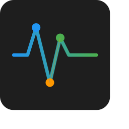
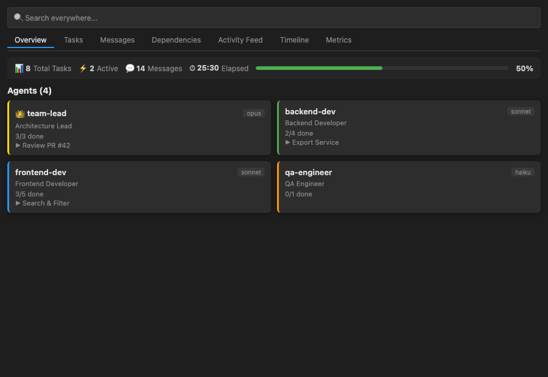
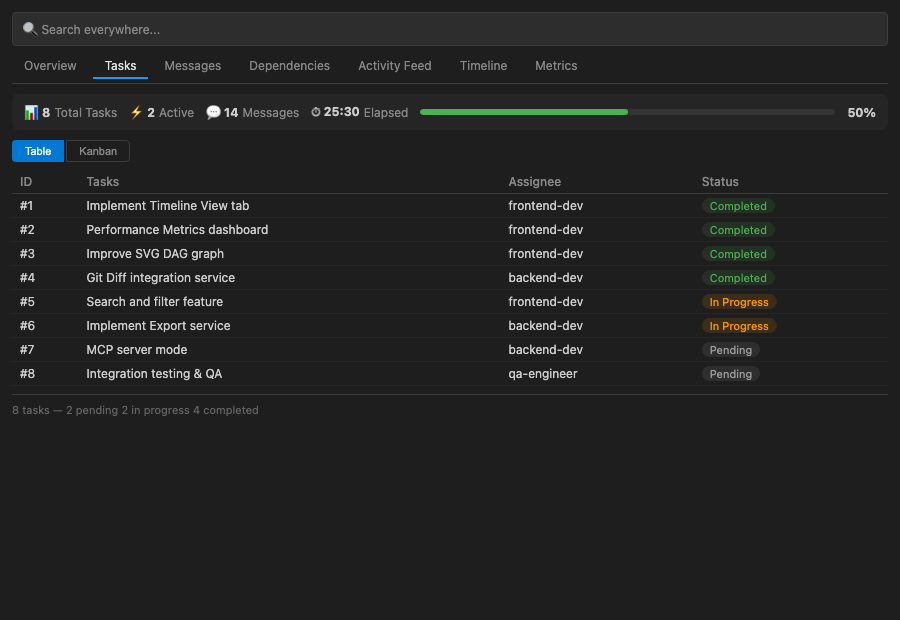
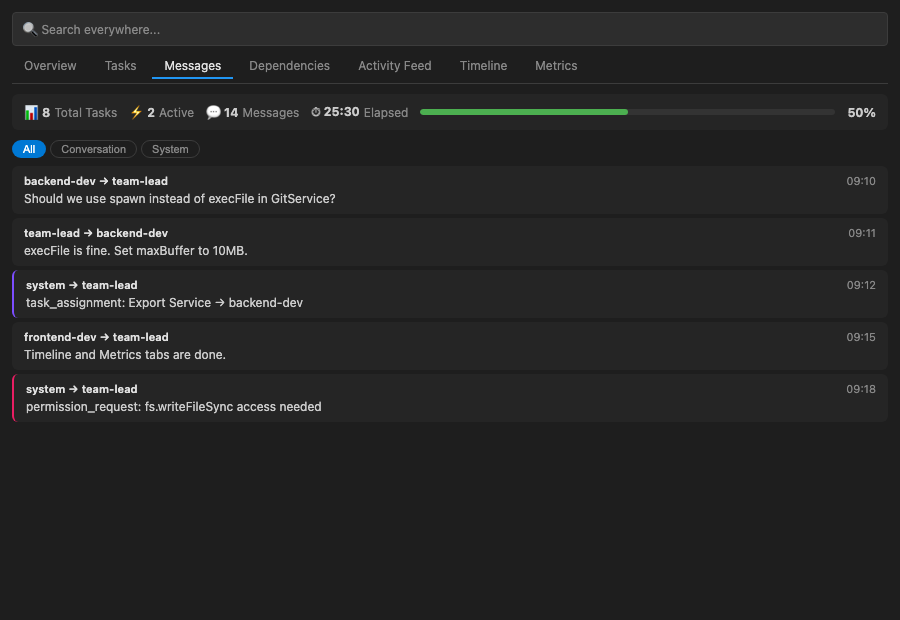
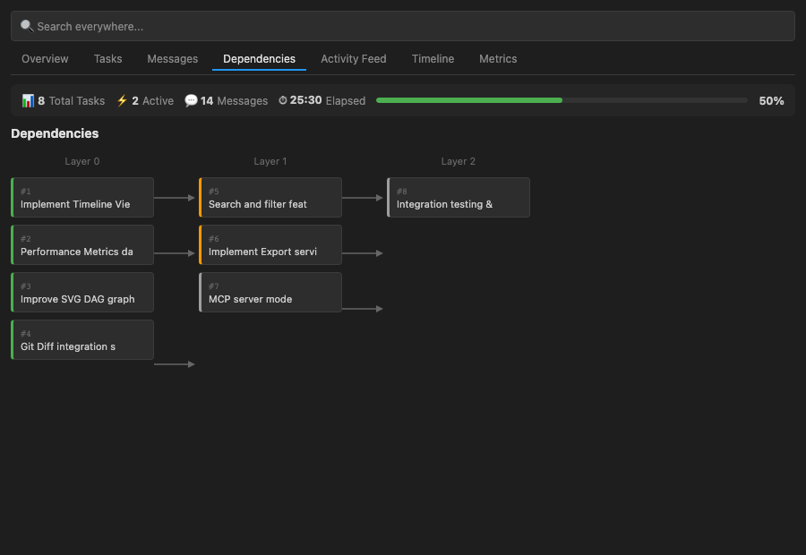
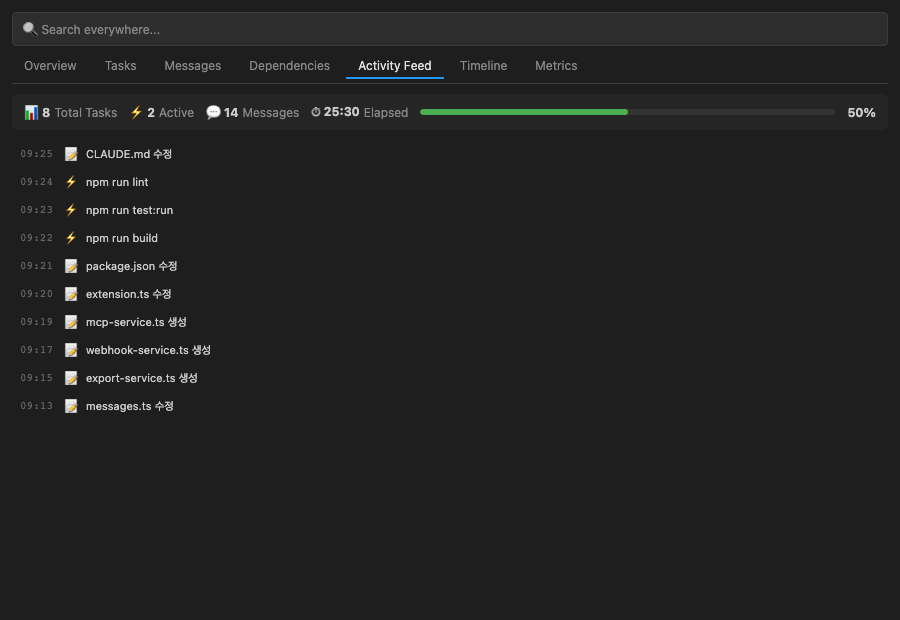
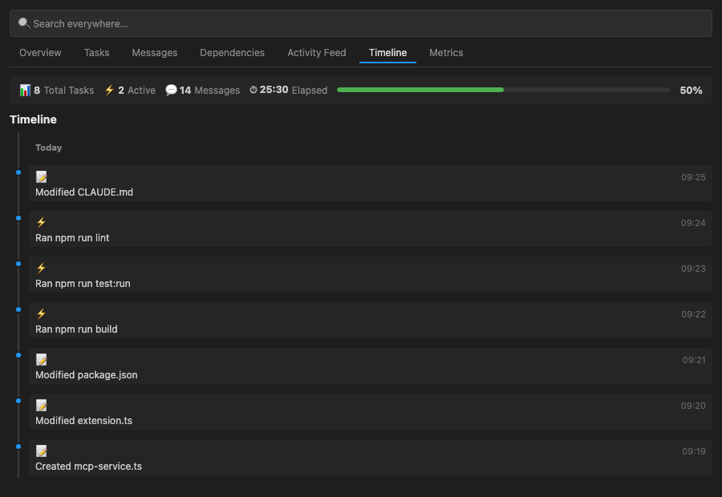
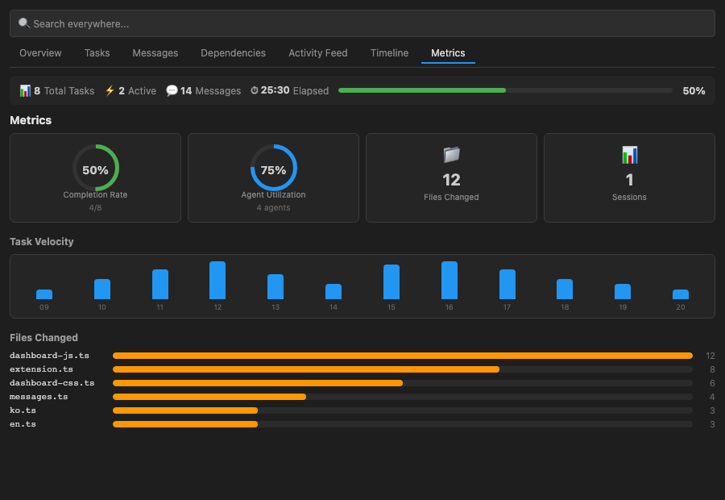

# Claude Flow Monitor

🌐 [한국어](README.ko.md) | **English** | [日本語](README.ja.md) | [中文](README.zh.md)

<p align="center">
  
</p>

<p align="center">
  <strong>Real-time visualization of Claude Code workflows and Agent Teams</strong>
</p>

<p align="center">
  <a href="https://marketplace.visualstudio.com/items?itemName=koh-dev.claude-flow-monitor">
    
  </a>
  <a href="LICENSE">
    
  </a>
</p>

---

## Features

Claude Flow Monitor is a standalone VS Code extension that tracks Claude Code activity in your open workspace and surfaces it through an integrated dashboard.

### Dashboard — 7 Tabs

| Tab | Description |
|-----|-------------|
| **Overview** | Active teams, agent count, task completion rate, session summary |
| **Tasks** | Kanban board (Table / Kanban toggle), blocker flags, task status |
| **Messages** | Agent inbox messages in real time |
| **Deps** | SVG-based DAG dependency graph with Bezier curve edges and arrows |
| **Activity** | Unified feed — file edits, commands, tasks, messages (up to 200 entries) |
| **Timeline** | Chronological event visualization with date grouping |
| **Metrics** | Donut charts, velocity chart, file edit heatmap |

### Additional Features

- **Sidebar mini-dashboard** — WebviewView panel with metrics, recent activity, and quick actions
- **Tree view** — Team → Agent → Task hierarchy in the Activity Bar sidebar
- **Global search** — `Ctrl+F` shortcut with per-tab filtering
- **AI file badges** — Explorer "AI" badge on files modified by Claude Code (via `FileDecorationProvider`)
- **Git integration** — Identifies AI-authored commits via `Co-Authored-By` and tracks AI contribution
- **Export** — Download session data as CSV or generate a Markdown summary report in an editor tab
- **Webhooks** — Send task/agent events to Slack or Discord via HTTP POST
- **MCP server mode** — Exposes `/api/teams`, `/api/activities`, `/api/metrics` as a local HTTP JSON API
- **Adaptive theming** — Inherits VS Code's dark, light, high-contrast, and custom themes (Dracula, One Dark Pro, etc.)
- **Localization** — Korean, English, Japanese, Chinese with auto-detect

---

## Screenshots

> Screenshots are located in the `images/` directory.

| Dashboard Overview | Kanban Tasks | Timeline |
|--------------------|--------------|----------|
### Screenshots & Feature Guide

#### Overview — Agent Status at a Glance

- Displays all team **agents as cards** with name, model, and role
- Shows each agent's **current task** and **completion progress** in real-time
- Top Stats Bar summarizes total tasks, active, messages, and elapsed time
- Lead agent marked with 👑 icon

#### Tasks — Task Management (Table/Kanban)

- **Table view**: Sortable columns for ID, title, assignee, and status
- **Kanban view**: 3-column board (Pending → In Progress → Completed)
- Blocker relationships shown (`blocked by: #5, #6`)
- **Search bar** filters by task name, assignee, or ID

#### Messages — Agent Communication

- Real-time **message stream** between agents (sender → receiver)
- **Filters**: All / Conversation / System messages
- System messages highlighted with purple border, permission requests with pink
- Message preview up to 500 characters

#### Dependencies — SVG Dependency Graph

- Visualizes task dependencies as a **DAG (Directed Acyclic Graph)**
- **Bezier curve connections** with arrows showing blocking relationships
- Layer-based grouping (Layer 0 → Layer 1 → Layer 2)
- Nodes colored by status (completed=green, in-progress=orange, pending=gray)

#### Activity Feed — Real-time Activity Stream

- Unified feed of file edits(📝), commands(⚡), task changes(✅), messages(💬)
- Displays up to 200 recent activities chronologically
- Searchable via the global search bar
- Timestamps in HH:MM:SS format

#### Timeline — Chronological Event Timeline

- All events displayed as a **vertical timeline**
- **Date grouping** (Today / Earlier)
- Color-coded dots by event type (file=blue, task=green, error=red)
- Expandable details (file paths, commands)

#### Metrics — Performance Dashboard

- **Donut charts**: Task completion rate and agent utilization
- **Velocity chart**: Activity count by hour (last 12 hours)
- **File heatmap**: Top 10 most edited files as horizontal bar chart
- Summary cards for sessions, messages, and elapsed time

---

## Installation

### VS Code Marketplace

1. Open VS Code.
2. Go to the Extensions panel (`Ctrl+Shift+X` / `Cmd+Shift+X`).
3. Search for **Claude Flow Monitor**.
4. Click **Install**.

Or install from the command line:

```bash
code --install-extension koh-dev.claude-flow-monitor
```

### Manual Install (.vsix)

1. Download the `.vsix` file from the [Releases](https://github.com/koh0001/claude-dashboard-extension/releases) page.
2. In VS Code, open the Extensions panel.
3. Click the `...` menu and select **Install from VSIX...**.
4. Select the downloaded file.

---

## Quick Start

1. Open any project that has Claude Code activity.
2. Open the Command Palette (`Ctrl+Shift+P` / `Cmd+Shift+P`).
3. Run **Claude Flow Monitor: Open Dashboard**.
4. The dashboard opens as a panel. Use the sidebar icon to access the mini-dashboard and tree view.

The extension activates automatically on VS Code startup (`onStartupFinished`) and watches `~/.claude/` for team configs, tasks, inboxes, and session JSONL files belonging to the current workspace.

---

## Configuration

| Setting | Type | Default | Description |
|---------|------|---------|-------------|
| `ccFlowMonitor.language` | `string` | `"auto"` | Dashboard language: `auto`, `ko`, `en`, `ja`, `zh` |
| `ccFlowMonitor.notifications` | `boolean` | `true` | Enable real-time VS Code notifications |
| `ccFlowMonitor.claudeDir` | `string` | `""` | Override the default `~/.claude/` directory path |
| `ccFlowMonitor.webhookUrl` | `string` | `""` | Slack or Discord webhook URL for event notifications |
| `ccFlowMonitor.mcpServerPort` | `number` | `0` | MCP HTTP server port (`0` = random available port) |
| `ccFlowMonitor.timeFormat` | `string` | `"HH:MM:SS"` | Time display format: `HH:MM:SS`, `HH:MM`, or `MM:SS` |

Settings are available under **File > Preferences > Settings > Claude Flow Monitor**, or directly in `settings.json`.

---

## Architecture

Core file-watching and parsing logic is provided by the `@cc-team-viewer/core` npm package. The extension wraps it with VS Code lifecycle management and a WebView-based dashboard UI.

```
src/
├── extension.ts                      # Entry point (activate / deactivate)
├── services/
│   ├── watcher-service.ts            # Wraps core TeamWatcher (VS Code lifecycle)
│   ├── workspace-matcher.ts          # SHA-256 hash matching for workspace ↔ project
│   ├── session-parser.ts             # JSONL session file parser
│   ├── git-service.ts                # Co-Authored-By commit parsing
│   ├── export-service.ts             # CSV / Markdown export
│   ├── webhook-service.ts            # Slack / Discord webhook POST
│   ├── mcp-service.ts                # MCP server and .mcp.json parsing
│   └── i18n-service.ts               # Extension i18n manager
├── providers/
│   ├── dashboard-provider.ts         # WebView panel (message queue, max 100)
│   ├── tree-provider.ts              # Sidebar tree view
│   ├── activity-feed-provider.ts     # Activity feed aggregator (max 200)
│   ├── file-decoration-provider.ts   # AI file badges
│   └── sidebar-dashboard-provider.ts # Sidebar mini-dashboard (WebviewView)
├── views/
│   ├── dashboard-html.ts             # HTML template (nonce CSP, 7 tabs + search bar)
│   ├── dashboard-css.ts              # Adaptive theme CSS
│   └── dashboard-js.ts               # Client-side state and DOM logic
├── i18n/
│   ├── locales/                      # ko, en, ja, zh translation files (80 keys each)
│   ├── types.ts                      # ExtendedTranslationMap
│   └── index.ts                      # i18n factory with fallback chain
└── utils/
    ├── escape-html.ts                # XSS prevention
    └── theme-detector.ts             # Theme mode detection
```

### Data Flow

```
File change  → core TeamWatcher → WatcherService → DashboardProvider → WebView
Workspace    → WorkspaceMatcher (SHA-256) → SessionParser → ActivityFeedProvider → WebView
Git repo     → GitService (Co-Authored-By) → FileDecorationProvider → Explorer badges
Notification → WatcherService → WebhookService → Slack / Discord
Export       → ExportService → CSV file / Markdown editor tab
MCP          → McpService → HTTP JSON API (localhost)
```

---

## Supported Languages

| Language | Code | README |
|----------|------|--------|
| Korean | `ko` | [README.ko.md](README.ko.md) |
| English | `en` | This file |
| Japanese | `ja` | [README.ja.md](README.ja.md) |
| Chinese | `zh` | [README.zh.md](README.zh.md) |

The UI language is auto-detected from VS Code's display language. Override with the `ccFlowMonitor.language` setting.

---

## Development

### Prerequisites

- Node.js 20+
- VS Code 1.90+

### Setup

```bash
git clone https://github.com/koh0001/claude-dashboard-extension.git
cd claude-dashboard-extension
npm install
```

### Commands

```bash
npm run build       # Bundle with tsup → dist/extension.js
npm run dev         # Watch mode (rebuilds on save)
npm run package     # Create .vsix package
npm test            # Run tests in watch mode (vitest)
npm run test:run    # Run tests once (CI)
npm run lint        # ESLint check
```

Press `F5` in VS Code to launch an **Extension Development Host** with the extension loaded.

---

## Contributing

Contributions are welcome. Please read [CONTRIBUTING.md](CONTRIBUTING.md) before submitting a pull request.

Issues and feature requests: [GitHub Issues](https://github.com/koh0001/claude-dashboard-extension/issues)

---

## License

[MIT](LICENSE) — Copyright (c) 2024 koh-dev

---

## Links

- [한국어 README](README.ko.md)
- [日本語 README](README.ja.md)
- [中文 README](README.zh.md)
- [Original project: cc-team-viewer](https://github.com/koh0001/cc-team-viewer)
- [Agent Teams documentation](https://code.claude.com/docs/en/agent-teams)
