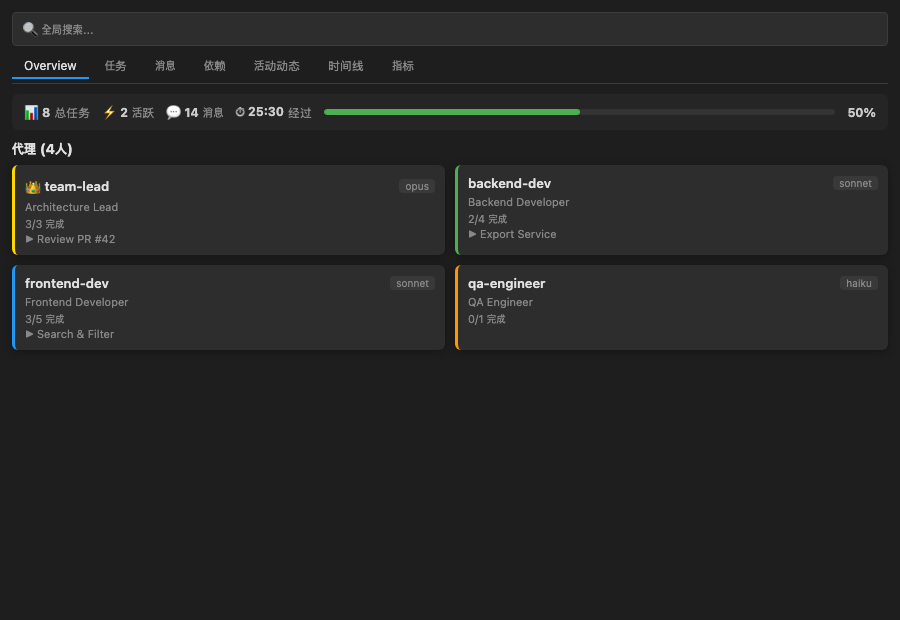
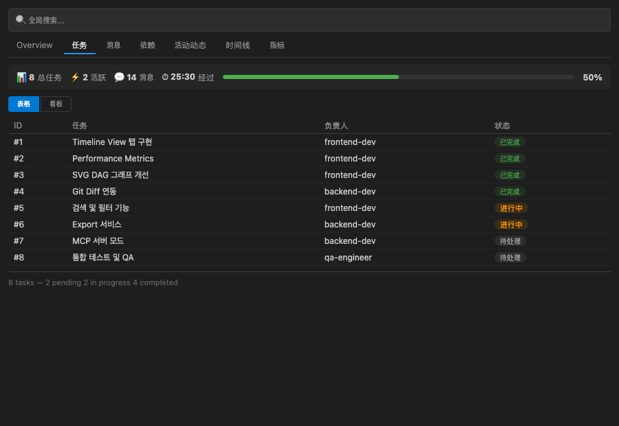
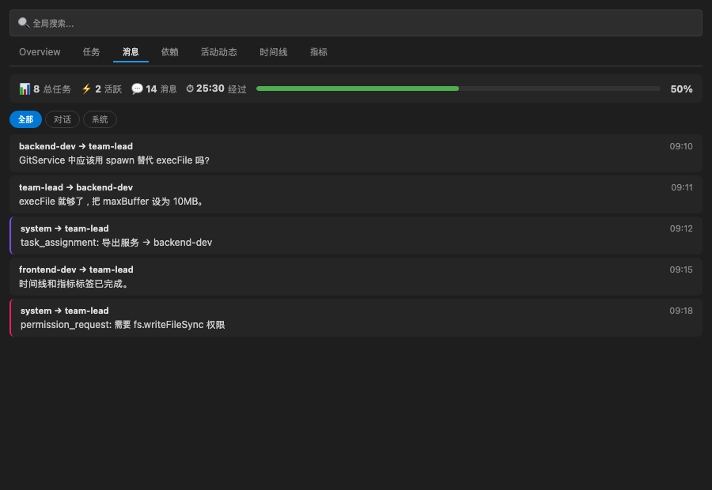
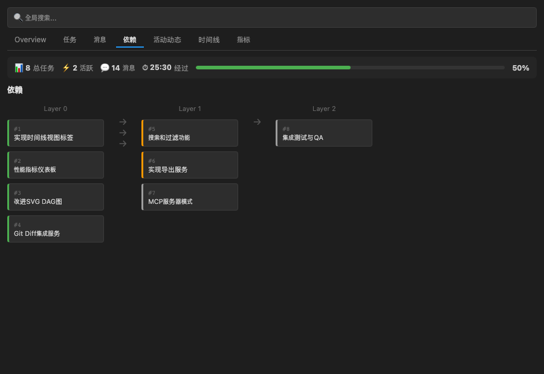
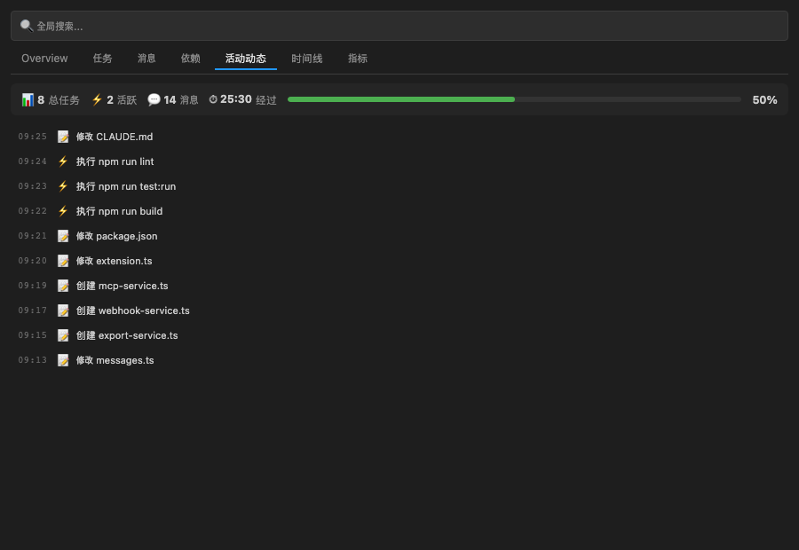
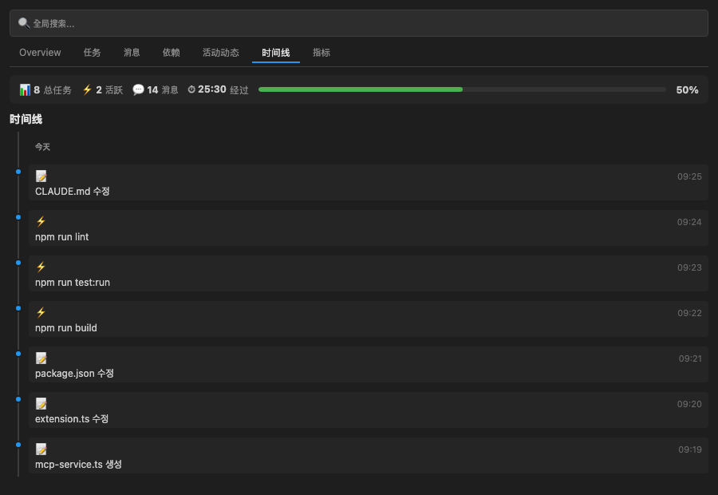
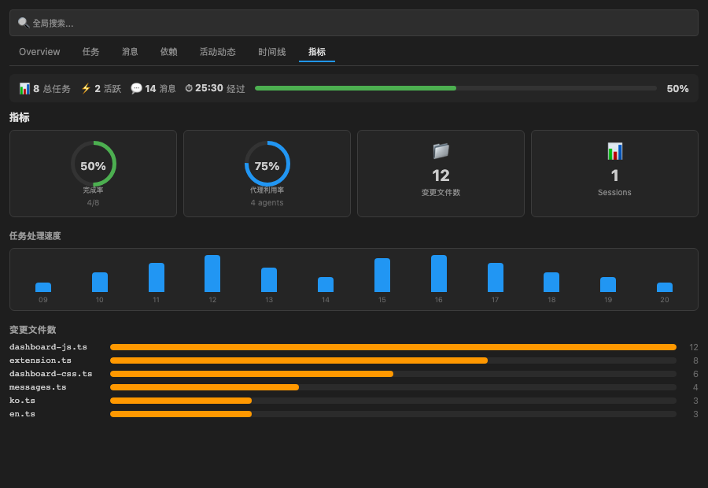

<p align="center">
  
</p>

<h1 align="center">Claude Flow Monitor</h1>

<p align="center">实时可视化 Claude Code 工作流程和 Agent Teams 的 VS Code 扩展</p>

<p align="center">
  
  
  
  
</p>

<p align="center">
  🌐 <a href="README.ko.md">한국어</a> | <a href="README.md">English</a> | <a href="README.ja.md">日本語</a> | 中文
</p>

---

## 主要功能

### 七标签页实时仪表板

通过七个专用标签页，全面掌握 Claude Code 的活动状态：

| 标签页 | 说明 |
|--------|------|
| **Overview** | 团队概览：会话数、文件数、任务完成率、活跃 Agent |
| **Tasks** | 任务看板（表格视图 / 看板视图切换）+ 阻塞关系显示 |
| **Messages** | Agent 间消息线程，支持全部 / 对话 / 系统过滤 |
| **Deps** | 任务依赖关系 DAG 图（SVG 贝塞尔曲线 + 箭头） |
| **Activity** | 实时活动流（文件 / 命令 / 任务 / 消息，最多 200 条） |
| **Timeline** | 时间轴视图，事件按日期分组可视化 |
| **Metrics** | 性能指标：甜甜圈图、速度图、文件热力图 |

### 侧边栏迷你仪表板

- 活动栏图标一键访问
- 树形视图：团队 → Agent → 任务 层级展示
- 状态栏显示团队名称与任务完成率
- Markdown 悬浮提示：会话 / 文件 / 任务 / 最近活动

### 搜索与过滤

- 全局搜索栏（`Ctrl+F` 快捷键）
- 按标签页独立过滤
- 支持任务名称、Agent 名称、消息内容搜索

### AI 文件徽章

- VS Code 资源管理器中 AI 修改过的文件显示 `AI` 徽章
- 通过 `FileDecorationProvider` 集成
- 基于 Git `Co-Authored-By` 提交识别 AI 贡献

### Git 集成

- 解析 Git 提交中的 `Co-Authored-By` 字段
- 追踪 AI 贡献文件
- GitService 自动扫描当前工作区仓库

### 导出功能

- **CSV 导出**：任务 / 活动数据下载
- **Markdown 报告**：在编辑器标签页中生成 AI 活动摘要报告

### MCP 服务器集成

- 解析 `.mcp.json` 并显示已连接的 MCP 服务器列表
- 可选启动 HTTP JSON API 模式（`/api/teams`, `/api/activities`, `/api/metrics`）
- 通过 `ccFlowMonitor.mcpServerPort` 设置端口

### Webhook 通知

- 支持 Slack / Discord Webhook POST 通知
- 触发时机：任务完成、Agent 加入 / 离开
- 通过 `ccFlowMonitor.webhookUrl` 配置地址

### Token 用量监控
- 从会话 JSONL 实时汇总**输入/输出/缓存 Token**
- Metrics 标签页展示 4 色 Token 卡片 + 总量条 + 比例分段条
- 输入(蓝)、输出(绿)、缓存创建(橙)、缓存读取(紫)颜色区分

### 截图与功能介绍

#### Overview — 一览 Agent 状态

- 以**卡片形式**展示团队中所有 Agent（名称、模型、角色）
- 实时显示每个 Agent 的**当前任务**和**完成进度**
- 顶部 Stats Bar 汇总任务总数、活跃数、消息数和经过时间
- 领导 Agent 以 👑 图标标记

#### Tasks — 任务管理（表格/看板）

- **表格视图**：可排序的 ID、任务名、负责人、状态列
- **看板视图**：Pending → In Progress → Completed 三列看板
- 显示阻塞关系（`blocked by: #5, #6`）
- **搜索栏**按任务名、负责人或 ID 过滤

#### Messages — Agent 间通信

- 实时展示 Agent 间的**消息流**（发送者 → 接收者）
- **过滤器**：全部 / 对话 / 系统消息
- 系统消息以紫色边框、权限请求以粉色边框区分
- 消息预览最多 500 字符

#### Dependencies — SVG 依赖关系图

- 以 **DAG（有向无环图）**可视化任务间的依赖关系
- **贝塞尔曲线连线**加箭头展示阻塞关系
- 按层分组（Layer 0 → Layer 1 → Layer 2）
- 节点按状态着色（完成=绿、进行中=橙、待处理=灰）

#### Activity Feed — 实时活动流

- 统一展示文件编辑(📝)、命令执行(⚡)、任务变更(✅)、消息(💬)
- 按时间顺序显示最近 200 条活动
- 支持全局搜索栏过滤活动内容
- 时间戳格式 HH:MM:SS

#### Timeline — 时间线事件视图

- 所有事件以**纵向时间线**形式展示
- **按日期分组**（今天 / 更早）
- 按事件类型着色圆点（文件=蓝、任务=绿、错误=红）
- 可展开查看详细信息（文件路径、命令等）

#### Metrics — 性能指标仪表板

- **环形图**：任务完成率和 Agent 利用率的可视化展示
- **速度图**：按小时统计活动数量的柱状图（最近 12 小时）
- **文件热力图**：编辑次数最多的 Top 10 文件水平柱状图
- 会话数、消息数、经过时间汇总卡片

---

## 安装

### VS Code Marketplace（即将上线）

在 VS Code 扩展商店中搜索 **Claude Flow Monitor**，或运行：

```
ext install koh-dev.claude-flow-monitor
```

### 手动安装（.vsix 文件）

```bash
git clone https://github.com/koh0001/claude-flow-monitor.git
cd claude-flow-monitor
npm install
npm run build
npm run package
# 在 VS Code 中安装生成的 .vsix 文件
# 命令面板 → "Extensions: Install from VSIX..."
```

---

## 快速开始

1. 安装扩展后，点击活动栏中的 Claude Flow Monitor 图标
2. 打开命令面板（`Cmd+Shift+P` / `Ctrl+Shift+P`）
3. 运行 **`Claude Flow Monitor: Open Dashboard`**
4. 仪表板打开后，通过标签页切换查看各类信息
5. 在侧边栏树形视图中选择团队，即可聚焦该团队数据

---

## 配置

在 VS Code 设置（`settings.json`）中可配置以下选项：

| 设置项 | 默认值 | 说明 |
|--------|--------|------|
| `ccFlowMonitor.language` | `auto` | 显示语言（`auto` / `ko` / `en` / `ja` / `zh`） |
| `ccFlowMonitor.notifications` | `true` | 启用实时通知 |
| `ccFlowMonitor.claudeDir` | `""` | 自定义 `~/.claude` 目录路径 |
| `ccFlowMonitor.webhookUrl` | `""` | Slack 或 Discord Webhook URL |
| `ccFlowMonitor.mcpServerPort` | `0` | MCP 服务器端口（`0` = 随机分配） |
| `ccFlowMonitor.timeFormat` | `HH:MM:SS` | 时间显示格式（`HH:MM:SS` / `HH:MM` / `MM:SS`） |

**环境变量**

| 变量 | 说明 |
|------|------|
| `CC_TEAM_VIEWER_CLAUDE_DIR` | 覆盖 `~/.claude` 目录路径（在 core 包层级生效） |

---

## 架构

```
src/
├── extension.ts                  → 入口（activate / deactivate）
├── services/
│   ├── watcher-service.ts        → 封装 core TeamWatcher（VS Code 生命周期）
│   ├── i18n-service.ts           → 扩展国际化管理
│   ├── workspace-matcher.ts      → 工作区 ↔ 项目哈希匹配
│   ├── session-parser.ts         → 会话 JSONL 解析
│   ├── git-service.ts            → Git Co-Authored-By 提交解析
│   ├── export-service.ts         → CSV / Markdown 报告导出
│   ├── webhook-service.ts        → Slack / Discord Webhook 通知
│   └── mcp-service.ts            → MCP 服务器集成与数据 API
├── providers/
│   ├── dashboard-provider.ts     → WebView 面板（消息队列，上限 100 条）
│   ├── tree-provider.ts          → 侧边栏树形视图（团队 → Agent → 任务）
│   ├── activity-feed-provider.ts → 活动流聚合（最多 200 条）
│   └── file-decoration-provider.ts → AI 修改文件徽章
├── types/
│   └── messages.ts               → 扩展 ↔ WebView 消息类型（判别联合）
├── views/
│   ├── dashboard-html.ts         → HTML 模板（nonce CSP，七标签页 + 搜索栏）
│   ├── dashboard-css.ts          → CSS（自适应主题 + 响应式 + 时间轴 / 指标）
│   └── dashboard-js.ts           → 客户端 JS（状态管理、DOM 操作、搜索过滤）
├── i18n/
│   ├── locales/                  → ko、en、ja、zh 翻译文件（各 69 个键）
│   ├── types.ts                  → ExtendedTranslationMap
│   └── index.ts                  → i18n 工厂（扩展 core，回退链）
└── utils/
    ├── escape-html.ts            → XSS 防护
    └── theme-detector.ts         → 主题模式检测
```

**数据流**

```
文件变更 → core TeamWatcher → WatcherService → DashboardProvider（消息队列）→ WebView（渲染）
工作区   → WorkspaceMatcher（SHA-256）→ SessionParser（JSONL）→ ActivityFeedProvider → WebView
Git 仓库 → GitService（Co-Authored-By）→ AiFileDecorationProvider → 资源管理器徽章
通知     → WatcherService → WebhookService → Slack / Discord Webhook
导出     → ExportService → CSV 文件 / Markdown 编辑器标签页
MCP      → McpService → HTTP JSON API（localhost）/ .mcp.json 解析
```

---

## 支持语言

| 语言 | 代码 | 状态 |
|------|------|------|
| 한국어（韩语） | `ko` | 完整支持（默认） |
| English（英语） | `en` | 完整支持 |
| 日本語（日语） | `ja` | 完整支持 |
| 中文（简体） | `zh` | 完整支持 |

语言可通过 `ccFlowMonitor.language` 设置，或在命令面板中运行 **`Claude Flow Monitor: Change Language`** 实时切换。

---

## 开发

### 环境要求

- Node.js 20.0.0 及以上
- VS Code 1.90.0 及以上

### 本地构建

```bash
npm install        # 安装依赖
npm run build      # 使用 tsup 打包 extension.js
npm run dev        # 监视模式（开发用）
npm test           # 运行测试（vitest watch 模式）
npm run test:run   # 单次运行测试（CI 用）
npm run lint       # ESLint 检查
npm run package    # 生成 .vsix 安装包
```

### 调试

在 VS Code 中按 `F5` 启动 **Extension Development Host**，即可在独立窗口中实时调试扩展。

---

## 贡献

欢迎提交 Issue 和 Pull Request！

请阅读 [CONTRIBUTING.md](CONTRIBUTING.md) 了解贡献规范和开发流程。

---

## 许可证

本项目基于 [MIT License](LICENSE) 开源。

---

<p align="center">
  由 <a href="https://github.com/koh0001">옥현 (koh-dev)</a> 开发
</p>
